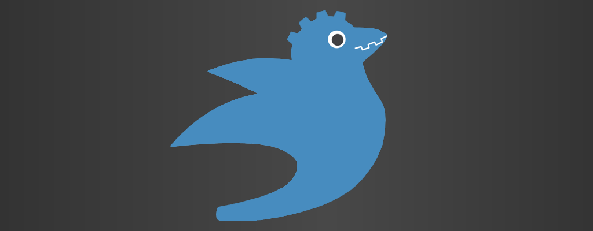

# 

# Bevy_Godot4

Bring the design power of Bevy's ECS to the mature engine capabilities of Godot 4.

*WARNING:* This crate is very early in development, and is very untested.

The architecture in this crate and most code is shamelessly taken from [bevy_godot](https://github.com/rand0m-cloud/bevy_godot), a similar crate for working with Godot 3 and gdnative. This crate will most likely be merged back into that one at some point.

## Setup

- Follow the steps outlined in the [GDExtension setup](https://github.com/godot-rust/gdext#getting-started) 

- Add this line to your cargo dependencies (along with the godot dependency from GDextension setup):
```
[dependencies]
godot = { from gdext setup }
...
bevy_godot4 = { git = "https://github.com/jrockett6/bevy_godot4", branch = "main" }
```
- Create a function that takes a `&mut App` and builds your bevy app, and annotate it with `#[bevy_app]`:
```rust
#[bevy_app]
fn build_app(app: &mut App) {
    app.add_system(my_system)
        .add_system(my_other_system)
}
```
- Cargo build your project, and make sure the dll is found by Godot via the .gdextension file. You should now have the BevyApp node avaiable to you in the Godot editor (though you may need to restart the editor). You can now add this BevyApp node as a Godot autoload.

## Features

At it's core, this crate is just a rust Godot node holding a bevy app that you can add as an autoload (singleton) in your Godot app. 

This crate also provides utilities to be able to work with Godot's systems from within the Bevy framework, such as:

## Godot nodes as components

`ErasedGd` is a Bevy component that holds Godot node instance id's. You can `Query` for these and `get::<T: Node>()` the node in your systems, e.g:

```rust
fn set_positions(mut erased_gds: Query<&mut ErasedGd>) {
    for mut node in erased_gds.iter_mut() {
        if let Some(node2D) = node.try_get::<Node2D>() {
            sprite.set_position(Vector2::ZERO)
        }
    }
}
```

## Schedule systems for the _process or _physics_process frames

Use `as_visual_system()` and `as_physics_system()` to schedule your systems to run on the desired Godot frame, e.g:

``` rust
app.add_system(set_positions.as_physics_system())
```

## Preload godot PackedScene resources in bevy loading states, and spawn scenes as `ErasedGd` components

Godot scenes (`.tscn` files)  can be "preloaded" (loaded in a dedicated Bevy loading `State`) in an `AssetCollection` with the use of `bevy_asset_loader`.

The scenes can then be queued for "spawning" (instantiate the `PackedScene` resource and add it to the Scene Tree) with the use of the `GodotScene`, e.g:
```rust
fn spawn_sprite(mut commands: Commands, assets: Res<MyAssets>) {
    commands.spawn(GodotScene::from_handle(&assets.sprite));
}
```

Checkout the examples folder for more.


